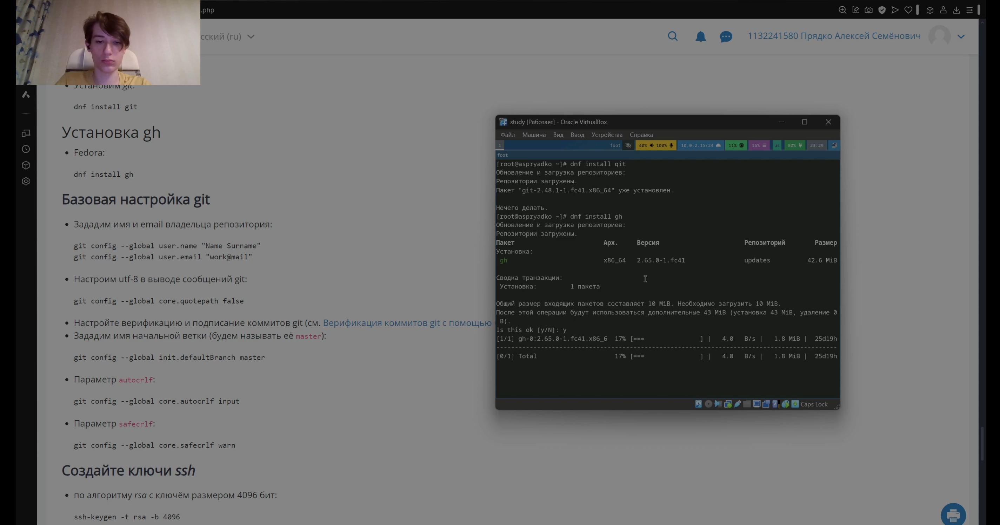
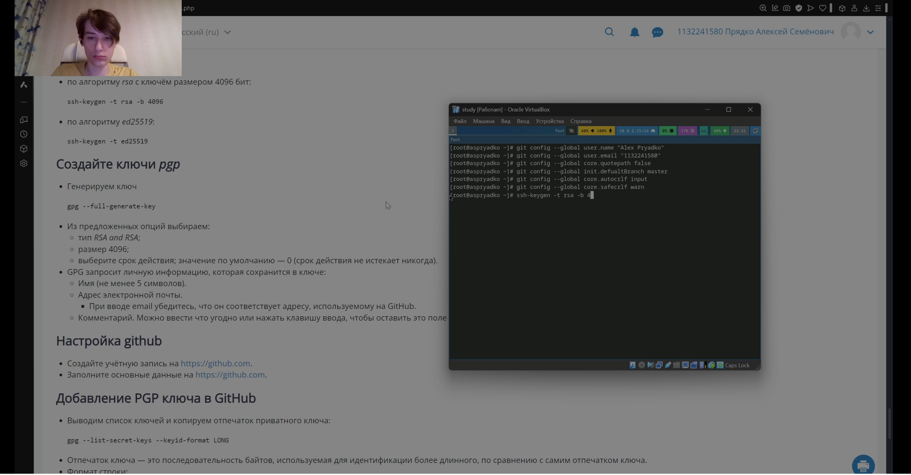
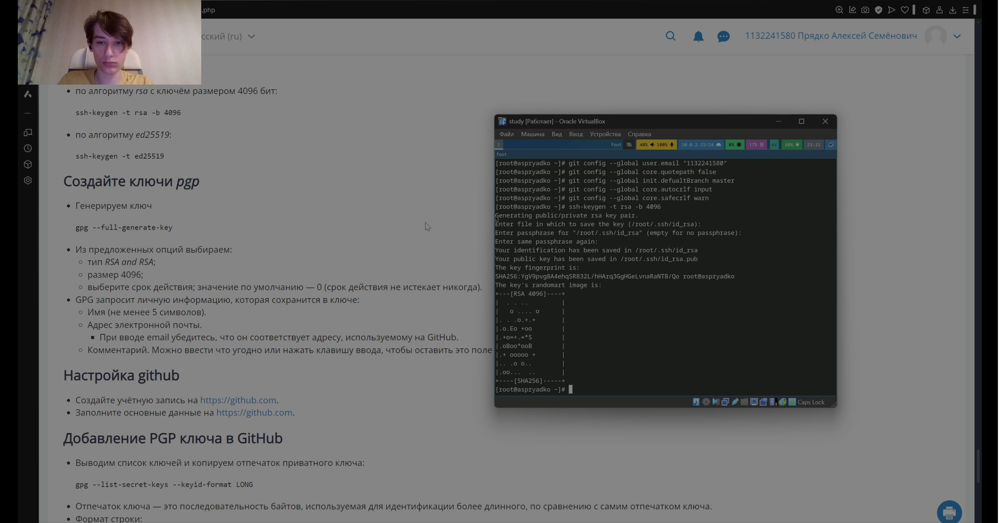
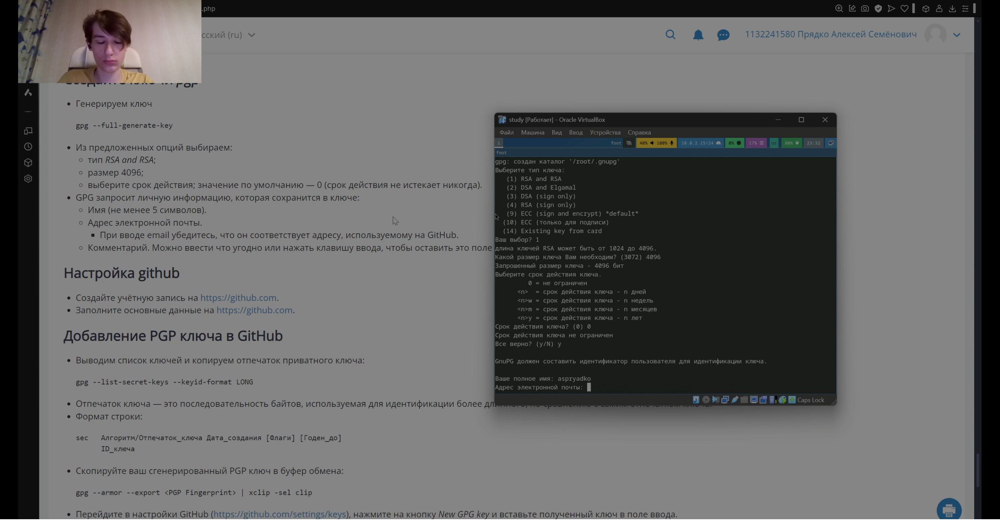
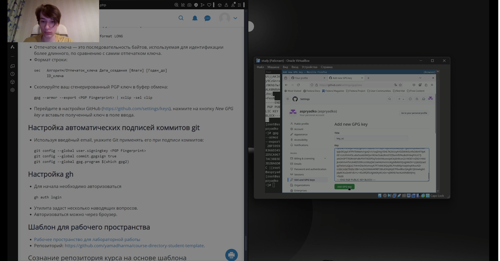
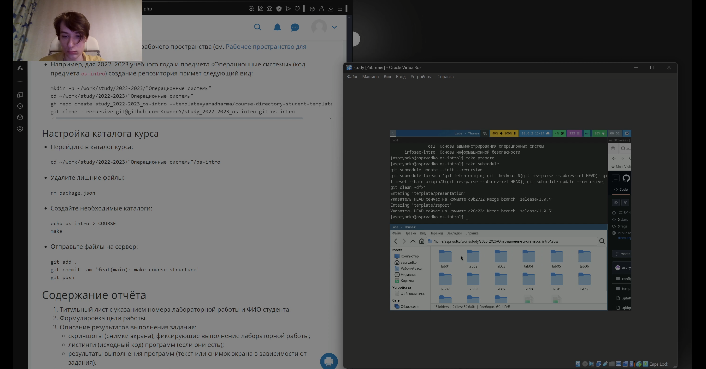
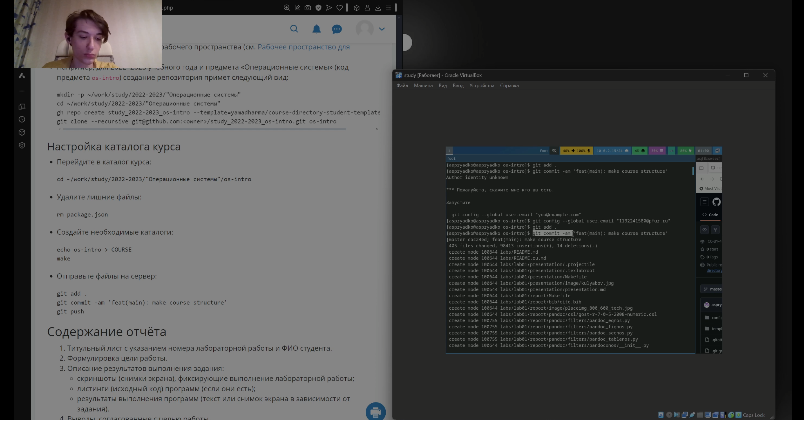

---
## Front matter
title: "Лабраторная работа №2"
subtitle: "Простейший вариант"
author: "Прядко Алексей Сёменович"

## Generic otions
lang: ru-RU
toc-title: "Содержание"

## Bibliography
bibliography: bib/cite.bib
csl: pandoc/csl/gost-r-7-0-5-2008-numeric.csl

## Pdf output format
toc: true # Table of contents
toc-depth: 2
lof: true # List of figures
lot: true # List of tables
fontsize: 12pt
linestretch: 1.5
papersize: a4
documentclass: scrreprt
## I18n polyglossia
polyglossia-lang:
  name: russian
  options:
	- spelling=modern
	- babelshorthands=true
polyglossia-otherlangs:
  name: english
## I18n babel
babel-lang: russian
babel-otherlangs: english
## Fonts
mainfont: IBM Plex Serif
romanfont: IBM Plex Serif
sansfont: IBM Plex Sans
monofont: IBM Plex Mono
mathfont: STIX Two Math
mainfontoptions: Ligatures=Common,Ligatures=TeX,Scale=0.94
romanfontoptions: Ligatures=Common,Ligatures=TeX,Scale=0.94
sansfontoptions: Ligatures=Common,Ligatures=TeX,Scale=MatchLowercase,Scale=0.94
monofontoptions: Scale=MatchLowercase,Scale=0.94,FakeStretch=0.9
mathfontoptions:
## Biblatex
biblatex: true
biblio-style: "gost-numeric"
biblatexoptions:
  - parentracker=true
  - backend=biber
  - hyperref=auto
  - language=auto
  - autolang=other*
  - citestyle=gost-numeric
## Pandoc-crossref LaTeX customization
figureTitle: "Рис."
tableTitle: "Таблица"
listingTitle: "Листинг"
lofTitle: "Список иллюстраций"
lotTitle: "Список таблиц"
lolTitle: "Листинги"
## Misc options
indent: true
header-includes:
  - \usepackage{indentfirst}
  - \usepackage{float} # keep figures where there are in the text
  - \floatplacement{figure}{H} # keep figures where there are in the text
---

# Цель работы
 
-Изучить идеологию и применение средств контроля версий.
-Освоить умения по работе с git.

# Задание

Создать базовую конфигурацию для работы с git. 
- Создать ключ SSH. 
- Создать ключ PGP. 
- Настроить подписи git. 
- Зарегистрироваться на Github. 
- Создать локальный каталог для выполнения заданий по предмету.

# Теоретическое введение

Системы контроля версий (Version Control System, VCS) применяются при работе нескольких человек над одним проектом. Обычно основное дерево проекта хранится в локальном или удалённом репозитории, к которому настроен доступ для участников проекта. При внесении изменений в содержание проекта система контроля версий позволяет их фиксировать, совмещать изменения, произведённые разными участниками проекта, производить откат к любой более ранней версии проекта, если это требуется.
В классических системах контроля версий используется централизованная модель, предполагающая наличие единого репозитория для хранения файлов. Выполнение большинства функций по управлению версиями осуществляется специальным сервером. Участник проекта (пользователь) перед началом работы посредством определённых команд получает нужную ему версию файлов. После внесения изменений, пользователь размещает новую версию в хранилище. При этом предыдущие версии не удаляются из центрального хранилища и к ним можно вернуться в любой момент. Сервер может сохранять не полную версию изменённых файлов, а производить так называемую дельта-компрессию — сохранять только изменения между последовательными версиями, что позволяет уменьшить объём хранимых данных.
Системы контроля версий поддерживают возможность отслеживания и разрешения конфликтов, которые могут возникнуть при работе нескольких человек над одним файлом. Можно объединить (слить) изменения, сделанные разными участниками (автоматически или вручную), вручную выбрать нужную версию, отменить изменения вовсе или заблокировать файлы для изменения. В зависимости от настроек блокировка не позволяет другим пользователям получить рабочую копию или препятствует изменению рабочей копии файла средствами файловой системы ОС, обеспечивая таким образом, привилегированный доступ только одному пользователю, работающему с файлом.
Системы контроля версий также могут обеспечивать дополнительные, более гибкие функциональные возможности. Например, они могут поддерживать работу с несколькими версиями одного файла, сохраняя общую историю изменений до точки ветвления версий и собственные истории изменений каждой ветви. Кроме того, обычно доступна информация о том, кто из участников, когда и какие изменения вносил. Обычно такого рода информация хранится в журнале изменений, доступ к которому можно ограничить.
В отличие от классических, в распределённых системах контроля версий центральный репозиторий не является обязательным.
Среди классических VCS наиболее известны CVS, Subversion, а среди распределённых — Git, Bazaar, Mercurial. Принципы их работы схожи, отличаются они в основном синтаксисом используемых в работе команд.

# Выполнение лабораторной работы

Установка git и gh(рис.1).

{#fig:001 width=70%}

Базовая настройка git(рис.2).

{#fig:001 width=70%}

Создание ключей SSH(рис.3).

{#fig:001 width=70%}

Создание ключей PGP(рис.4).

{#fig:001 width=70%}

Добваление ключа PGP в github(рис.5).

{#fig:001 width=70%}

Создание репрозитория курса на основе шаблона(рис.6).

{#fig:001 width=70%}

Настройка каталога курса(рис.7).

{#fig:001 width=70%}

# Контрольные вопросы

Что такое системы контроля версий (VCS) и для решения каких задач они предназначаются?
Системы контроля версий (VCS) предназначены для управления изменениями в коде, ведения истории изменений, работы в команде и отката к предыдущим версиям.

Объясните следующие понятия VCS и их отношения: хранилище, commit, история, рабочая копия. Что представляют собой и чем отличаются централизованные и децентрализованные VCS?
Хранилище содержит все файлы и их изменения. Commit фиксирует изменения в хранилище. История хранит последовательность commit'ов. Рабочая копия – это текущая версия файлов на локальном устройстве. Централизованные VCS используют единое удалённое хранилище, децентрализованные позволяют работать с репозиториями локально без постоянного подключения к серверу.

Приведите примеры VCS каждого вида.
Централизованные: SVN, Perforce. Децентрализованные: Git, Mercurial.

Опишите действия с VCS при единоличной работе с хранилищем.
Создание репозитория, добавление файлов, фиксирование изменений (commit), просмотр истории, откат к предыдущим версиям.

Опишите порядок работы с общим хранилищем VCS.
Клонирование репозитория, создание новой ветки, внесение изменений, commit, отправка изменений в удалённое хранилище, слияние изменений.

Каковы основные задачи, решаемые инструментальным средством git?
Управление версиями кода, ведение истории изменений, работа с ветками, разрешение конфликтов, совместная работа над проектом.

Назовите и дайте краткую характеристику командам git.
git init – создание репозитория
git clone – клонирование репозитория
git add – добавление файлов в индекс
git commit – фиксация изменений
git push – отправка изменений в удалённый репозиторий
git pull – получение изменений с удалённого репозитория
git merge – слияние веток
git branch – управление ветками
git checkout – переключение между ветками
git status – проверка состояния репозитория

Приведите примеры использования при работе с локальным и удалённым репозиториями.
Локальный репозиторий: git init, git add ., git commit -m "Сообщение"
Удалённый репозиторий: git clone URL, git pull origin main, git push origin main

Что такое и зачем могут быть нужны ветви (branches)?
Ветви позволяют разрабатывать новые функции, исправлять ошибки и тестировать изменения без вмешательства в основную версию проекта.

Как и зачем можно игнорировать некоторые файлы при commit?
Файлы игнорируются с помощью .gitignore, чтобы не добавлять временные файлы, логи, зависимости и другие ненужные файлы в репозиторий.

# Выводы
В процессе выполнения лабраторной работы я ознакомился с идеалогией применения средств контроля версий git, и узнал базовые команды для работы с git.

# Список литературы
